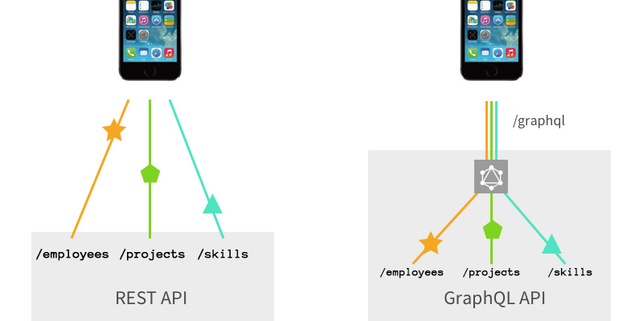

# Nexus GraphQL Server

A wrapper around the Nexus REST API using GraphQL.

### Contents

- Overview
- Nexus API
- Getting Started
- Example Queries
- TO-DO


## Overview
Using GraphQL with the Nexus API could simplify syncing operations, reducing the number of round trips between the client and Nexus API.

Here's a modified image originally created for the
[GraphQL vs REST](https://dev-blog.apollodata.com/graphql-vs-rest-5d425123e34b)
post by [@stubailo](https://github.com/stubailo) which tries to explain one of the differences
between REST and GraphQL.



This shows that with GraphQL, you can send one query to the GraphQL server which then
grabs the separate resources and returns them in one response.
With REST, each resource requires an individual request and response between the client and REST API.

This project uses:
- [apollo server](https://github.com/apollographql/apollo-server)
- [graphql-tools](https://github.com/apollographql/graphql-tools) to generate the schema
- [GraphiQL](https://github.com/graphql/graphiql) for exploring the GraphQL

This project started off its life in [Apollo Launchpad](https://launchpad.graphql.com/new)


## Nexus REST API
The documentation of the Nexus API is available here:
https://developer.knowledge-architecture.com

Any questions related to the functionality of the Nexus REST API should be directed to [support@knowledge-architecture.com](mailto:support@knowledge-architecture.com)

## Getting Started

### Clone and Install
Clone this repo and run npm install

```
git clone https://github.com/andrewgodwin86/nexus-graphql-server <my-directory>
cd <my-directory>
npm install
```
### Create Environment Variables
Create a file named `.env` in the root of the project folder and define the KA_CLIENT_ID and KA_CLIENT_KEY variables as follows:
```
KA_CLIENT_ID="YourClientID"
KA_CLIENT_KEY="YourClientKey"
```
You can request your client ID and client key from [Knowledge Architecture](mailto:support@knowledge-architecture.com).

### Start the Server
Run the start script
```
npm start
```
The GraphQL endpoint will be available at `http://localhost:4000/graphql`

## Example queries

Copy and paste the following query snippets into GraphiQL and hit play!

A list of projects with some additional details
```javascript
{
  projects {
    project {
      projectNumber
      projectName
      clientName
      city
      state
      country
      employeeCount
    }
  }
}
```

TO-DO: Reimplement StreamItems defs
A list of Stream Items and their data
```javascript
{
  streamItemList {
    streamItemDetails {
      titleWithEntityNames
      contentWithEntityNames
      dateStamp
      displayEntityType
      itemType
      likeCount
      commentCount
      authorName
      mentionsList {
        entityID
        entityType
        entityName
        communitySiteID
        publicSite
        deleted
      }
      hashtagsList {
        hashtagID
      }
      likesList {
        authorID
        authorName
      }

    }  
  }
}
```

## TO-DO
- [ ] Add more example queries
- [x] Move contents of server folder into root directory.
- [x] Allow related entity queries in Company/Contact/Opportunity like Project/Employee
- [x] Update to Apollo Server 2
- [x] Refactor typeDefs/resolvers for Projects
- [x] Refactor typeDefs/resolvers for Employees
- [x] Refactor typeDefs/resolvers for Companies 
- [x] Refactor typeDefs/resolvers for Contacts
- [x] Refactor typeDefs/resolvers for EntityColumnMappings
- [x] Refactor typeDefs/resolvers for Opportunities
- [ ] Refactor typeDefs/resolvers for StreamItems
- [ ] Refactor typeDefs/resolvers for Media
- [x] Refactor typeDefs/resolvers for Relationships
- [ ] Investigate fixing node version in package.json... >8.11?
- [ ] Update schema create to use a swagger-to-graphql tool
- [ ] Use cache such as DataLoader to prevent duplicate queries
- [ ] Expand ability to pass URL params to entity list requests
